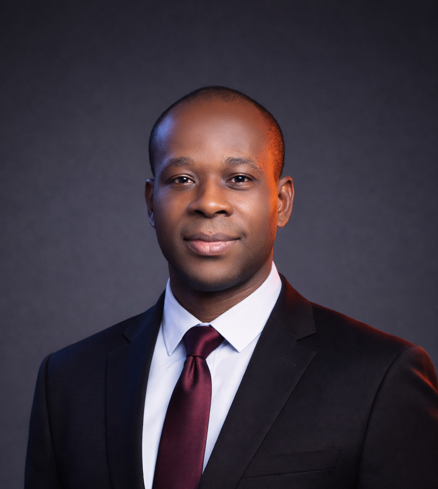

::: {.hero}

::: {.hero-photo}
{#profile-photo}
:::

::: {.hero-content}

# Eugene Sogbe, PhD

Researcher in Transport and Mobility

:::

:::

---

I am a researcher in transport and mobility specialising in public transport, travel behaviour, transport safety, and transport planning. My research seeks to improve transport systems through a deeper understanding of travel behaviour, evidence-based planning, and the development of safer, more sustainable mobility solutions.

---

[ Google Scholar](https://scholar.google.com/citations?hl=en&user=56hnKfYAAAAJ&view_op=list_works&sortby=pubdate){target="_blank"}

[ ORCID](https://orcid.org/0000-0002-9243-3481){target="_blank"}

[ ResearchGate](https://www.researchgate.net/profile/Eugene-Sogbe){target="_blank"}

[ LinkedIn](https://www.linkedin.com/in/eugene-sogbe){target="_blank"}

[ Email](mailto:eksogbe@gmail.com)

## Research Areas

### 🚉 Public Transport

Understanding and improving public transport systems, service quality, accessibility, and ridership.

### 🚶 Travel Behaviour

Investigating behavioural factors influencing travel choices and mobility patterns.

### 🛡️ Transport Safety

Improving transport safety through behavioural research and evidence-based interventions.

### 🗺 Transport Planning

Supporting sustainable and efficient transport systems through planning and policy research.

